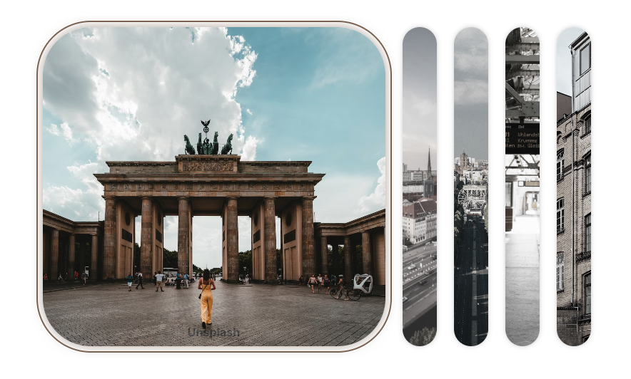

# 01 Expanding Cards

## Requirements

- [x] Create a container with 5 cards.
- [x] When a card is clicked, it should expand to fill the container; the other cards should shrink to fit the container.
- [x] Accessibility Support (Keyboard Navigation).

## Considerations

- Use **CSS Variables** as parameters to define the card styles, including the background image and the theme color.

## Reference

- https://www.udemy.com/course/50-projects-50-days/
- https://developer.mozilla.org/en-US/docs/Web/Accessibility/ARIA/Roles/tablist_role
- https://developer.mozilla.org/en-US/docs/Web/Accessibility/ARIA/Roles/tab_role
