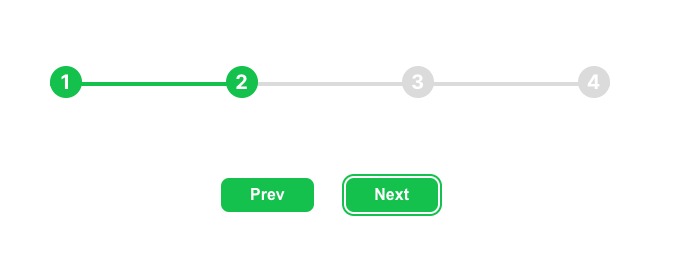

# 02 Progress Steps

## Requirements

- [x] Create a progress bar with 4 steps.
- [x] When a prev or next button is clicked, the progress bar should move to the next or previous step.
- [x] Accessibility Support (Keyboard Navigation).

## Considerations

- Use `role="group"` to group the steps.
- Use `aria-labelledby` to describe the button text for screen readers.
- Use `aria-current` to indicate the current step.
- Use `aria-live` to announce the current step when the user navigates through the buttons.

## Reference

- https://www.udemy.com/course/50-projects-50-days/learn/lecture/23595222#overview
- https://developer.mozilla.org/en-US/docs/Web/Accessibility/ARIA/Roles/group_role
- https://developer.mozilla.org/en-US/docs/Web/Accessibility/ARIA/ARIA_Live_Regions
- https://developer.mozilla.org/en-US/docs/Web/Accessibility/ARIA/Attributes/aria-current
